# Agent Ecosystem Architecture Diagram

This document contains the PlantUML diagram describing the complete agent, skill, and prompt ecosystem for the iliad-apis-features project.

## Overview

The ecosystem consists of:
- **2 Primary Agents**: Specialized for marine data discovery and OGC building block generation
- **6 Support Services**: Helper agents for specific tasks
- **8 Skills**: Reusable capabilities for data processing and validation
- **1 Workflow Prompt**: Guides end-to-end building block creation
- **External Systems**: Data sources and validation services

## PlantUML Diagram

```plantuml
@startuml Agent Ecosystem Architecture

title Iliad APIs Features - Agent, Skill, and Prompt Ecosystem

' Define agent stereotypes
skinparam actor {
  BackgroundColor #LightBlue
  BorderColor #000000
  BorderThickness 2
}

skinparam package {
  BackgroundColor #LightGray
  BorderColor #000000
  BorderThickness 1
}

skinparam note {
  BackgroundColor #LightYellow
  BorderColor #000000
}

' User entry point
actor "User/Developer" as User

' Primary Agents
package "Primary Agents" as PrimaryAgents {
  agent "@marine-content-specialist" as MarineSpecialist
  agent "@building-block-generator" as BuildingBlockGenerator
}

' Orchestration Layer
package "Orchestration Layer" as Orchestration {
  agent "@marine-workflow-orchestrator" as MarineWorkflowOrchestrator
}

' Support Services
package "Support Services" as SupportServices {
  agent "@marine-data-specialist" as MarineDataSpecialist
  agent "@metadata-dispatcher" as MetadataDispatcher
  agent "@validation-agent" as ValidationAgent
  agent "@geojson-to-jsonfg-converter" as GeoJSONConverter
  agent "@stac-metadata-generator" as STACGenerator
  agent "@dcat-metadata-generator" as DCATGenerator
}

' Skills
package "Skills" as Skills {
  component "bblock-container-validation" as BBlockValidation
  component "csv-to-metadata" as CSVToMetadata
  component "esri-client" as EsriClient
  component "geojson-to-jsonfg-converter" as GeoJSONSkill
  component "metadata-extraction" as MetadataExtraction
  component "netcdf-to-stac" as NetCDFToSTAC
  component "ogc-web-services-client" as OGCClient
  component "web-browsing-mcp" as WebBrowsing
}

' Prompts
package "Prompts" as Prompts {
  note "building-blocks-from-marine-data.md" as MarinePrompt
}

' External Systems
package "External Systems" as External {
  database "HELCOM" as HELCOM
  database "EMODnet" as EMODnet
  database "ICES" as ICES
  database "OBIS" as OBIS
  database "ODP" as ODP
  component "Docker OGC Postprocessor" as DockerOGC
  component "OGC Building Blocks Registry" as OGCRegistry
}

' User interactions
User --> MarineSpecialist : "Discover marine data"
User --> BuildingBlockGenerator : "Generate building blocks"
User --> MarinePrompt : "Use workflow prompt"

' Agent orchestration relationships
MarineSpecialist --> MarineDataSpecialist : calls for data retrieval
MarineSpecialist --> MarineWorkflowOrchestrator : requests metadata/enrichment
MarineSpecialist --> BuildingBlockGenerator : orchestrates block creation

BuildingBlockGenerator --> MarineWorkflowOrchestrator : requests validation/support

MarineWorkflowOrchestrator --> MetadataDispatcher : delegates metadata generation
MarineWorkflowOrchestrator --> ValidationAgent : delegates container validation
MarineWorkflowOrchestrator --> GeoJSONConverter : delegates format enrichment
MarineWorkflowOrchestrator --> STACGenerator : delegates catalog item creation
MarineWorkflowOrchestrator --> DCATGenerator : delegates semantic descriptions

' Building block generator relationships
BuildingBlockGenerator --> MarineWorkflowOrchestrator : requests tool support

' Skill usage relationships
MarineSpecialist --> OGCClient : uses for querying OGC services
MarineSpecialist --> WebBrowsing : uses for marine data sources
MarineSpecialist --> MetadataExtraction : uses for data analysis

BuildingBlockGenerator --> MetadataExtraction : uses for example analysis
BuildingBlockGenerator --> NetCDFToSTAC : uses for data conversion
BuildingBlockGenerator --> CSVToMetadata : uses for metadata generation
BuildingBlockGenerator --> BBlockValidation : uses for container validation

' Prompt relationships
MarinePrompt --> MarineSpecialist : guides usage
MarinePrompt --> BuildingBlockGenerator : guides usage

' External system interactions
MarineSpecialist --> HELCOM : queries marine data
MarineSpecialist --> EMODnet : queries thematic data
MarineSpecialist --> ICES : queries fish stocks
MarineSpecialist --> OBIS : queries species data
MarineSpecialist --> ODP : queries features API

BuildingBlockGenerator --> DockerOGC : runs validation
BuildingBlockGenerator --> OGCRegistry : publishes blocks

' Data flow relationships
MarineDataSpecialist --> MarineSpecialist : returns sample data
MetadataDispatcher --> MarineSpecialist : returns metadata
ValidationAgent --> BuildingBlockGenerator : returns validation results
GeoJSONConverter --> BuildingBlockGenerator : returns enriched data

' Output artifacts
note right of BuildingBlockGenerator : Produces:\n- bblock.json\n- schema.yaml\n- context.jsonld\n- examples/\n- tests/

note right of MarineSpecialist : Produces:\n- Data profiles\n- Vocabulary mappings\n- Block specifications

' Legend
legend right
  |= Type |= Symbol |
  | Primary Agent | <&person> |
  | Support Service | <&cog> |
  | Skill | <&wrench> |
  | Prompt | <&document> |
  | External System | <&server> |
endlegend

@enduml
```



## Key Relationships

### Primary Agent Orchestration
- **@marine-content-specialist** → **@building-block-generator**: Main workflow orchestration
- **@marine-content-specialist** → **@marine-data-specialist**: Data retrieval
- **@marine-content-specialist** → **@marine-workflow-orchestrator**: Requests metadata and enrichment support

### Tool Orchestration
- **@building-block-generator** → **@marine-workflow-orchestrator**: Requests validation and metadata support
- **@marine-workflow-orchestrator** → **@validation-agent**: Container validation
- **@marine-workflow-orchestrator** → **@metadata-dispatcher**: Example metadata
- **@marine-workflow-orchestrator** → **@geojson-to-jsonfg-converter**: Format enrichment
- **@marine-workflow-orchestrator** → **@stac-metadata-generator**: Catalog item creation
- **@marine-workflow-orchestrator** → **@dcat-metadata-generator**: Semantic description generation

### Skill Usage
- **@marine-content-specialist** uses: `ogc-web-services-client`, `web-browsing-mcp`, `metadata-extraction`
- **@building-block-generator** uses: `metadata-extraction`, `netcdf-to-stac`, `csv-to-metadata`, `bblock-container-validation`

### External System Integration
- **Marine Data Sources**: HELCOM, EMODnet, ICES, OBIS, ODP
- **Validation Services**: Docker OGC Postprocessor
- **Publication Targets**: OGC Building Blocks Registry

## Workflow Patterns

### Pattern 1: Discovery → Generation
```
User Request → @marine-content-specialist → @building-block-generator → OGC Block Package
```

### Pattern 2: Multi-Agent Orchestration
```
User Request → @marine-content-specialist
                    ↓
              Calls multiple support services
                    ↓
              @building-block-generator → Enhanced Block Package
```

### Pattern 3: Batch Processing
```
User Request → @marine-content-specialist → Multiple Specifications
                    ↓
              @building-block-generator → Multiple Block Packages
```

## File Locations

- **Agents**: `.agents/` directory
  - `.building-block-generator.md`
  - `.marine-content-specialist.md`

- **Skills**: `.skills/` directory
  - `bblock-container-validation/`
  - `csv-to-metadata/`
  - `esri-client/`
  - `geojson-to-jsonfg-converter/`
  - `metadata-extraction/`
  - `netcdf-to-stac/`
  - `ogc-web-services-client/`
  - `web-browsing-mcp/`

- **Prompts**: `.prompts/` directory
  - `building-blocks-from-marine-data.md`

- **Guides**: `.guides/` directory
  - `AGENT-ARCHITECTURE.md`
  - `AGENT-QUICK-REFERENCE.md`

- **Diagram**: `.docs/` directory
  - `agent-ecosystem-diagram.puml` (this file)

## Usage Instructions

1. **View the Diagram**: Use any PlantUML viewer or online renderer
2. **Understand Flow**: Follow the arrows from User → Primary Agents → Support Services → Skills
3. **Identify Dependencies**: Check which agents call which support services
4. **Find Skills**: See which skills are used by which agents
5. **External Integration**: Note connections to external data sources and services

## Legend

| Symbol | Type | Description |
|--------|------|-------------|
| 👤 | Primary Agent | Core specialized agents |
| ⚙️ | Support Service | Helper agents for specific tasks |
| 🔧 | Skill | Reusable capability modules |
| 📄 | Prompt | Workflow guidance documents |
| 🖥️ | External System | Data sources and external services |

---

**Generated**: 2024-04-20  
**Version**: 1.0  
**Source**: Agent definitions and architecture guides