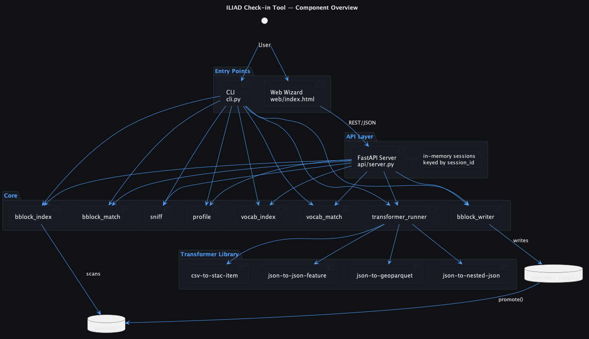
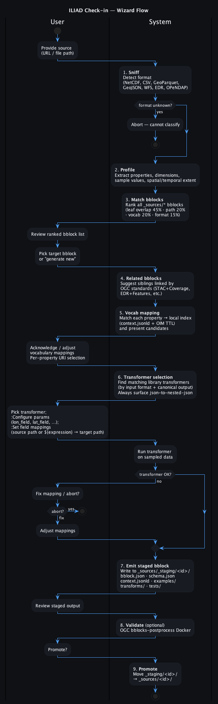
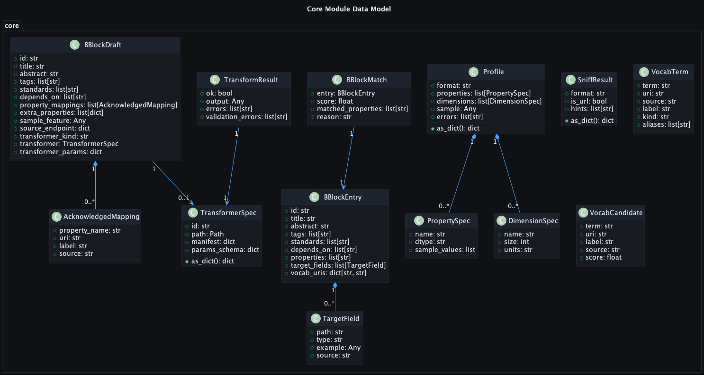
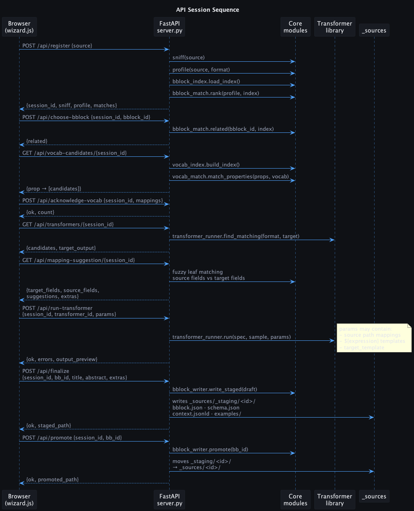
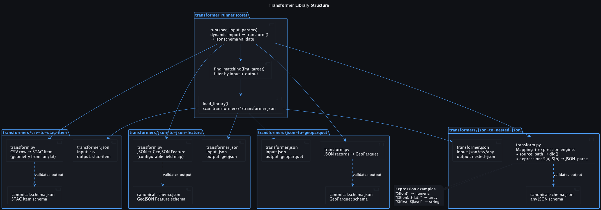
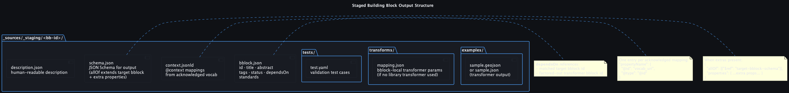

# ILIAD Check-in Tool — Architecture

The check-in tool is a guided wizard that registers a new data source against the ILIAD OGC Building Block ecosystem. It handles format detection, property profiling, building-block matching, vocabulary mapping, transformer configuration, and staged building-block emission — through both a CLI and a browser-based UI backed by a FastAPI server.

---

## 1. Component Overview

| Source | Image |
|---|---|
| [docs/01-overview.puml](docs/01-overview.puml) |  |

The tool has two independent entry points sharing the same `core` library:

- **CLI** (`cli.py`) — interactive terminal wizard driven by `click` and `rich`. Prompts the user at each step; `--non-interactive` flag accepts all defaults.
- **Web wizard** (`web/index.html` + `web/static/wizard.js`) — single-page vanilla JS UI backed by the FastAPI server. Steps rendered progressively; each step activates only after the previous completes.

Both entry points call the same `core.*` modules in the same sequence.

### Package layout

```
checkin/
├── cli.py                    # Terminal entry point
├── api/
│   └── server.py             # FastAPI app + all /api/* endpoints
├── web/
│   ├── index.html            # Wizard HTML shell
│   └── static/
│       ├── wizard.js         # Step logic + DOM rendering
│       └── style.css         # Dark-theme styling
├── core/
│   ├── sniff.py              # Format detection
│   ├── profile.py            # Property + dimension extraction
│   ├── bblock_index.py       # Building block catalog
│   ├── bblock_match.py       # Scoring + ranking
│   ├── vocab_index.py        # Local vocabulary registry
│   ├── vocab_match.py        # Property → vocab candidates
│   ├── transformer_runner.py # Transformer execution + validation
│   └── bblock_writer.py      # Staged bblock emission
└── transformers/
    ├── csv-to-stac-item/
    ├── json-to-json-feature/
    ├── json-to-geoparquet/
    └── json-to-nested-json/
```

---

## 2. Wizard Flow

| Source | Image |
|---|---|
| [docs/02-wizard-flow.puml](docs/02-wizard-flow.puml) |  |

The wizard runs nine sequential steps:

| Step | Module | Description |
|---|---|---|
| 1. Sniff | `sniff.py` | Classify source format: `netcdf`, `csv`, `tsv`, `geojson`, `json`, `geoparquet`, `ogc-wfs`, `ogc-wms`, `ogc-edr`, `opendap` |
| 2. Profile | `profile.py` | Extract flat property list (dotted-path names, dtypes, sample values) and spatial/temporal dimensions |
| 3. Match bblocks | `bblock_match.py` | Score all indexed bblocks; return ranked list (no cutoff) |
| 4. Related bblocks | `bblock_match.related()` | Suggest OGC-standard siblings (e.g. STAC + Coverage, EDR + Features) |
| 5. Vocab mapping | `vocab_match.py` | Match each property to local vocab candidates (NERC, CF, Darwin Core, OIM) |
| 6. Transformer | `transformer_runner.py` | Select, configure, and test a library transformer; show pass/fail |
| 7. Emit staged bblock | `bblock_writer.py` | Write complete bblock to `_sources/_staging/<id>/` |
| 8. Validate _(optional)_ | Docker | Run `ogcincubator/bblocks-postprocess` against the staged bblock |
| 9. Promote | `bblock_writer.promote()` | Move `_staging/<id>/` → `_sources/<id>/` |

Nothing advances past step 6 unless the transformer runs clean against the sampled data.

---

## 3. Core Module Data Model

| Source | Image |
|---|---|
| [docs/03-core-modules.puml](docs/03-core-modules.puml) |  |

### Key types

**`SniffResult`** — carries the detected `format` string and whether the source is a remote URL.

**`Profile`** — the flat property inventory of a source. Each `PropertySpec` has a dotted-path `name` (e.g. `where.lon`, `properties.species`), a `dtype`, and sample values. `DimensionSpec` entries cover NetCDF-style coordinate axes.

**`BBlockEntry`** — one indexed building block. `target_fields` are dotted-path slots extracted from the bblock's `schema.json` (or from `examples/*.json` as fallback when the schema is a `$ref`). `vocab_uris` are the `@context` bindings from `context.jsonld`.

**`BBlockMatch`** — a scored pairing of a `Profile` to a `BBlockEntry`, with `matched_properties` and a human-readable `reason` string breaking down the four scoring signals.

**`VocabTerm`** / **`VocabCandidate`** — local vocabulary entries. Built once from all `context.jsonld` files in `_sources/` and from the OIM TTL ontologies. Scored against property names using exact then rapidfuzz fuzzy matching.

**`BBlockDraft`** — the full description of the bblock to emit, including the acknowledged vocabulary mappings, extra user-named properties, the chosen transformer, its parameters, and a sample feature from the transformer output.

---

## 4. API Session Sequence

| Source | Image |
|---|---|
| [docs/04-api-sequence.puml](docs/04-api-sequence.puml) |  |

The FastAPI server maintains wizard state in an in-memory dict keyed by `session_id` (12-char hex). Each endpoint reads from and writes to the session dict. Sessions are not persisted across server restarts.

### Endpoints

| Method | Path | Purpose |
|---|---|---|
| `POST` | `/api/register` | Sniff + profile source; rank all bblocks; open session |
| `POST` | `/api/choose-bblock` | Record target bblock; return related siblings |
| `GET` | `/api/vocab-candidates/{session_id}` | Return vocab candidates for all profile properties |
| `POST` | `/api/acknowledge-vocab` | Store accepted property→URI mappings in session |
| `POST` | `/api/external-vocab` | Return NERC/CF/Darwin Core search links for a query term |
| `GET` | `/api/transformers/{session_id}` | Return matching library transformers + always-available `json-to-nested-json` |
| `GET` | `/api/mapping-suggestion/{session_id}` | Fuzzy-match source fields → target-bblock fields; return unmapped extras |
| `POST` | `/api/run-transformer` | Execute transformer on sampled data; validate output |
| `POST` | `/api/finalize` | Write staged bblock to `_sources/_staging/` |
| `POST` | `/api/promote` | Move staged bblock to `_sources/` |

---

## 5. Transformer Library

| Source | Image |
|---|---|
| [docs/05-transformer-library.puml](docs/05-transformer-library.puml) |  |

Each transformer is a self-contained directory under `transformers/<name>/`:

```
transformers/<name>/
├── transformer.json     # id, title, input, output, params-schema
├── canonical.schema.json  # JSON Schema for valid output
├── transform.py         # transform(input_obj, params) -> Any
└── tests/               # input samples + expected params
```

### Library entries

| Transformer | Input | Output | Notes |
|---|---|---|---|
| `csv-to-stac-item` | CSV rows (list of dicts) | STAC Item(s) | Derives geometry from `lon_field`/`lat_field` params |
| `json-to-json-feature` | JSON object | GeoJSON Feature | Field-mapping configurable via params |
| `json-to-geoparquet` | JSON records | GeoParquet | Uses `geopandas` |
| `json-to-nested-json` | Any (JSON/CSV/…) | Arbitrary nested JSON | Universal; always surfaced regardless of input format |

### `json-to-nested-json` mapping engine

Each mapping entry in `params.mappings` is either a **path copy** or a **template expression**:

```jsonc
// Path copy — resolves dotted path in input
{ "source": "properties.depth_m", "target": "depth", "type": "number" }

// Expression — ${path} placeholders, JSON-parsed after substitution
{ "expression": "[${lon}, ${lat}]", "target": "geometry.coordinates" }
{ "expression": "${first_name} ${last_name}", "target": "name" }
{ "expression": "{\"type\":\"Point\",\"coordinates\":[${lon},${lat}]}", "target": "geometry" }
```

Expressions:
1. Substitute every `${path}` with `dig(input, path)` (null if missing).
2. Attempt `json.loads()` on the result — on success returns the parsed type (array, object, number, bool); on failure returns the string.
3. Apply `coerce(value, type)` from the mapping.

The dotted-path resolver (`dig`) supports nested keys, list indices `[0]`, glob `*`, and append `[]`.

---

## 6. Staged Building Block Output

| Source | Image |
|---|---|
| [docs/06-bblock-output.puml](docs/06-bblock-output.puml) |  |

`bblock_writer.write_staged()` produces a complete OGC Building Block package at `_sources/_staging/<id>/`:

| File | Content |
|---|---|
| `bblock.json` | OGC metadata — id, title, abstract, tags, status (`under-development`), `dependsOn` (target bblock + any library transformer bblocks), standards |
| `schema.json` | JSON Schema for the output format. When extra user-named properties exist, wraps the target bblock schema in `allOf` and appends extra property definitions |
| `context.jsonld` | JSON-LD `@context` populated from acknowledged vocab mappings (`"propertyName": {"@id": "vocab_uri"}`) |
| `description.json` | Human-readable dataset description |
| `examples/<id>.json` | Sample output from the transformer run |
| `transforms/mapping.json` | Transformer parameters (field mappings, expressions, template) for bblock-local transforms |
| `tests/test.yaml` | OGC bblocks validation test stub |

`bblock_writer.promote(id)` moves the entire staged directory to `_sources/<id>/`.

---

## 7. Scoring — Building Block Matching

`bblock_match.rank()` scores every indexed bblock against the profile and returns all of them sorted descending. The score is a weighted sum of four signals:

| Signal | Weight | Description |
|---|---|---|
| Leaf-name overlap | 45% | Fuzzy match of profile property leaves vs bblock target-field leaves (rapidfuzz token_set_ratio ≥ 85%) |
| Full-path overlap | 20% | Exact set intersection of dotted paths |
| Vocabulary overlap | 20% | Profile property leaves vs bblock `@context` term names |
| Format/tag overlap | 15% | Format-to-tag hints (e.g. `csv` → `{table, observation, sosa}`) vs bblock tags + standards |

A "leaf" is the last segment of a dotted path with list indices stripped (`properties.depth_m[0]` → `depth_m`). This normalises both flat and nested schemas for comparison.

---

## 8. Vocabulary Index

`vocab_index.build_index()` builds the local vocabulary registry once at startup from two sources:

1. **`context.jsonld` files** in `_sources/*/` — collects all `@context` key→URI bindings, tagged by originating bblock id.
2. **OIM TTL ontologies** in `OIM/*.ttl` — parsed with `rdflib`; collects OWL properties, OWL classes, and SKOS concepts with their `rdfs:label` / `skos:prefLabel`.

Result: a `VocabIndex` with `by_term` (term → list of `VocabTerm`) and `by_uri` lookups.

`vocab_match.match_one()` scores candidates: exact term match (score 1.0) > fuzzy label/term match (rapidfuzz ratio). Up to `k=5` candidates returned per property.

For terms with no local match, `vocab_match.external_hints()` returns direct search links to NERC, CF, Darwin Core, and WoRMS for the user to follow manually.
